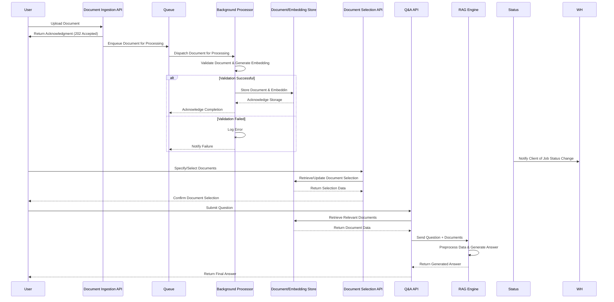
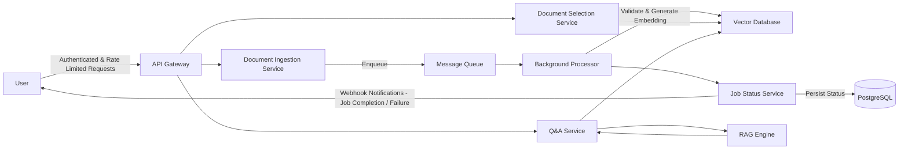

### Sequence Diagram


### HLD


### Project Structure
```
rag-qa-system/
├── app/
│   ├── api/                    # FastAPI application and route definitions
│   │   ├── __init__.py
│   │   ├── documents.py        # Document ingestion endpoints
│   │   ├── qa.py              # Q&A endpoints
│   │   └── selection.py        # Document selection endpoints
│   │
│   ├── core/                   # Core business logic
│   │   ├── __init__.py
│   │   ├── document_processor.py  # Validates and processes uploaded documents
│   │   ├── embeddings.py         # Generates and manages embeddings
│   │   ├── rag_engine.py         # Integrates with the RAG model to generate answers
│   │   └── queue.py              # Handles asynchronous task queuing (or interfaces with an external queue)
│   │
│   ├── models/                 # Data models and schemas (Pydantic, ORM models)
│   │   ├── __init__.py
│   │   ├── document.py
│   │   ├── embedding.py
│   │   └── qa.py
│   │
│   ├── database/
│   │   ├── __init__.py
│   │   ├── base.py           # SQLAlchemy base setup
│   │   ├── session.py        # Database session management
│   │   └── models/           # SQLAlchemy ORM models
│   │       ├── __init__.py
│   │       ├── document.py
│   │
│   └── common/                  # Shared utilities
│       ├── __init__.py
│       ├── config.py         # Centralized configuration and environment variables
│       └── logger.py         # Logging configuration and helper functions
│
├── tests/                      # Test suite for all components
│   ├── __init__.py
│   ├── test_api/
│   │   ├── test_documents.py
│   │   ├── test_qa.py
│   │   └── test_selection.py
│   ├── test_core/
│   │   ├── test_document_processor.py
│   │   ├── test_embeddings.py
│   │   └── test_rag_engine.py
│   └── test_storage/
│       ├── test_postgres.py
│       └── test_vector_store.py
│
├── docker/                     # Docker related files for containerization
│   ├── Dockerfile              # Defines the service container
│   └── docker-compose.yml      # Orchestrates services (FastAPI, PostgreSQL, queue, etc.)
│
├── .env.example                # Template for environment variables
├── .gitignore                  # Specify files/folders to ignore in Git
├── README.md                   # Project overview, setup, and usage instructions
├── requirements.txt            # Top-level dependencies for the project
└── main.py                     # Application entry point (e.g., launching the FastAPI server)
```