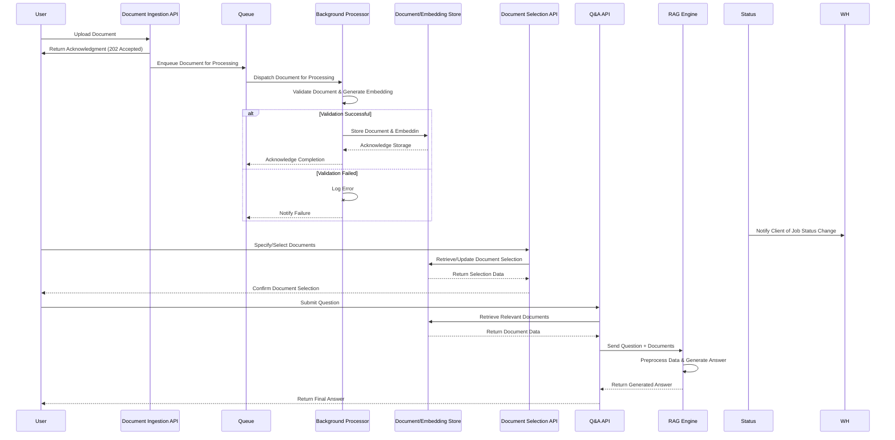
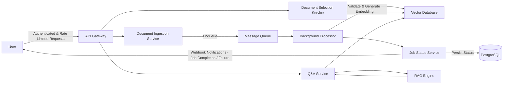

## Diagrams
### Sequence Diagram

### HLD

## Deployment

This section provides step-by-step instructions to deploy the application locally or in a production-like environment using Docker. The deployment process ensures that all services—from the Document Ingestion API to the RAG-based Q&A service—are containerized, making the solution portable and scalable.

Prerequisites
1. Docker: Ensure Docker is installed
2. Docker Compose: Install Docker Compose.
3. Environment Variables: Review and update the configuration in example.env.

#### Step 1: Clone the Repository
#### Step 2: Configure Environment Variables
1. Rename example.env to .env.
2. Update the necessary environment variables (e.g., database connection details, secret keys).

#### Step 3: Build Docker Images
`docker compose build`

#### Step 4: Run the Application
`docker compose up -d`

#### Step 5: Database Migrations

Run the following command to upgrade the database schema:
`docker compose exec api alembic upgrade head`

#### Step 6: Monitoring and Logs

To monitor the application logs, use:
`docker compose logs -f`

#### Step 7: Stopping the Application

`docker compose down`

### CI/CD Integration

To streamline deployments:
- Automated Testing: Integrate your test suite into your CI/CD pipeline to run on each commit.
- Build & Push: Configure your CI/CD system (e.g., GitHub Actions, GitLab CI) to build Docker images and push them to a container registry.
- Automated Deployment: Use deployment scripts to update your production environment automatically upon successful builds.

Troubleshooting
- Container Health: Verify running containers with docker ps.
- Environment Variables: Double-check that the .env file is configured correctly.
- Logs: Use docker-compose logs -f to identify any runtime errors.
