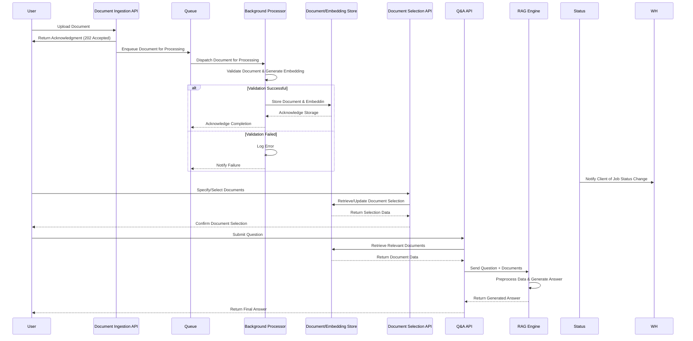
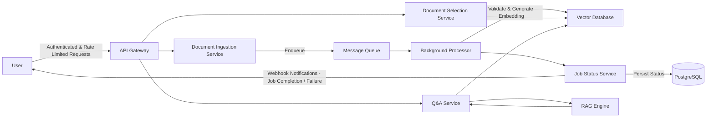

### Sequence Diagram


### HLD



### Project Structure
```
app
├── api
│   ├── __init__.py
│   ├── documents.py
│   └── qa.py
├── common
│   ├── __init__.py
│   ├── config.py
│   ├── health_check.py
│   └── logger.py
├── database
│   ├── models
│   │   ├── __init__.py
│   │   └── document.py
│   ├── __init__.py
│   ├── base.py
│   ├── s3.py
│   └── session.py
├── models
│   ├── __init__.py
│   ├── document.py
│   └── qa.py
├── repositories
│   └── document_repository.py
├── services
│   ├── __init__.py
│   ├── document_processor.py
│   ├── document_service.py
│   └── qa_service.py
├── README.md
├── main.py
├── pyproject.toml
├── start.sh
└── worker.py
```
